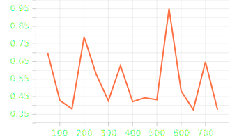
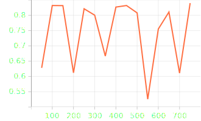
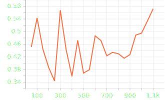
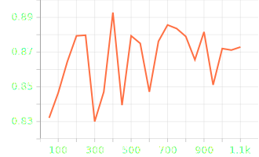
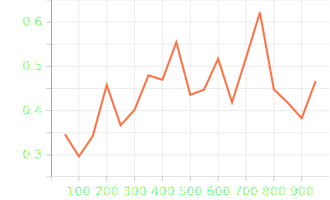
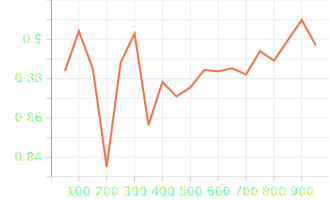

РЕКОМЕНДУЕТСЯ ознакомится сначала с результатами анализа датасета.
Анализ датасета был проведён в ноутбуке: `notebooks/pda.ipynb` 

Во всех гипотезах записи обрезались до 2-х секундной длительности. Такое значение было выбрано, основываясь на следующих фактах\предположениях:
* медианное значение продолжительности аудиозаписи в датасетах: ~5 сек.
* я предпологаю, что в течение почти половины аудиозаписи большинства примеров должно было бы быть сказано хотя бы одно слово, благодаря чему решение задачи будет возможным

Для всех экспериментов была использована модель для классификации изображений: `ResNet18`. Эта легковестная модель в своё время стала прорывом в области обработки изображений благодаря её "Residual connection". Задача классификации аудиозаписей часто очень похожа на задачу классификации ч/б изображений, что делает эту модель отличным кандидатом на роль модели для отбора признаков и реализации baseline-а.

Т.к. датасет сбалансированн по классам, а специальных смещений в пользу recall или presicion заданием не предусмотрено, в данной работе используется только метирка accuracy.

## Гипотезы
* чистый pitch
* спектрограмма в диапазоне только низких частот
* мел-спектрограмма в диапазоне только низких частот

### Гипотеза №1 "Предсказание на основе значения фундаментальной частоты"
*config path*: `experiments/exp1-pitch-resnet18/config.yaml`

В этой гипотезе в качестве фичи используется значение фундаментальной частоты посчитанное при помощи втроенной фукнции `torchaudio`.
Ожидаемый диапазон значений фундаментальной часототы для мужчины: от 85 до 155 Гц, для женщины: от 165 до 255 Гц
В данном эксперименте частота детектируется в диапазоне от 50 до 700 Гц (с запасом).

Val loss:

Val accuracy:

### Гипотеза №2 "Предсказание на основе спектрограммы в низком диапазоне частот"
*config path*: `experiments/exp2-spectrogram-resnet18/config.yaml`

В этой гипотезе в качестве фичи используется значение спектрограммы посчитанное при помощи втроенной фукнции `torchaudio`. 
Значение частот для спектрограммы также берётся в диапазоне, в котором находится фундаментальная частота, свойственная людям. 
В ноутбуке: `notebooks/pda.ipynb` был подобран верхний предел значения частоты, используемый в данном эксперименте.

Вообще говоря, мы не можем с точностью определить частоту колебания человеческих связок через фундаментальную частоту, да и сама фундаментальная частота определяется с некоторой погрешностью. Идея этого эксперимента в том, чтобы дать модели более широкий частотный диапазон с соответсвующей каждой частоте мощностью сигнала.

Val loss:

Val accuracy:

### Гипотеза №3 "Предсказание на основе мел-спектрограммы в низком диапазоне частот"
*config path*: `experiments/exp3-melspectrogram-resnet18/config.yaml`

В этой гипотезе в качестве фичи используется значение мел-спектрограммы посчитанное при помощи втроенной фукнции `torchaudio`. 
Значение частот для спектрограммы также берётся в диапазоне, в котором находится фундаментальная частота, свойственная людям. 

Здесь продолжается идея предыдущего эксперимента: передавать модели более широкий диапазон частот.
Однако, теперь мы дополнительно уточняем более низкие частоты с помощью mel-фильтров. Таким образом, изменение более низких частот (более близких к фундаментальной частоте) становится заметнее.

Val loss:

Val accuracy:

Среди всех проведённых экспериментов, самым успешным оказался последний. Сделан такой вывод на основании двух признаков:
* наилучшая метрика
* наиболее плавный график сходимости

С целью дальнейшего повышения качества, я бы рекомендовал следующие пункты:
* проверить наличие тишины в записях (удаление тишины при необходимости)
* перевод мощности сигнала в dB (логарифмическую шкалу), которая будет отражать громкость так, как её воспринимает человек

С целью повышения генерализации модели, я бы рекомендовал следующие пункты:
* случайное изменение громкости аудиозаписей в процессе обучения
* назначать каждой записи вес, в зависимости от того, кто эту запись говорит
* делать случайное смещение pitch-а (небольшое, ~лад/полулад вверх и вниз, чтобы это не повлияло на восприятие пола говорящего) в процессе обучения
* делать случайное увеличение/уменьшение темпа записи